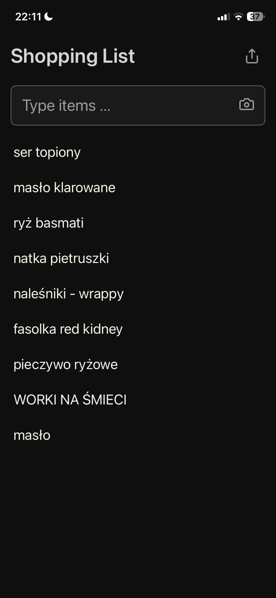

# Shopping List Today 📝

**Live app → https://shoppinglist.today**

A simple shopping list app that feels like digital pen and paper. No login required — your list is stored locally on your device.

_An intentionally minimal PWA exploring how much clarity and usability can be achieved with almost no features._

It works offline by default, with one optional AI-assisted feature: photo scan for handwritten shopping lists.

→ See the [photo-scan case study](#case-study-scanning-a-real-handwritten-shopping-list): reading a real handwritten list with a vision LLM.

## Features ✨

### Interaction & UX

- **Quick Adding**: Type items separated by `, ` or `. ` (comma/dot + space), press Enter
- **Photo Scan** 📷: Snap a photo of a handwritten or printed list — a vision LLM extracts the items for review before adding
- **Smart Duplicates**: Adding an existing item that's checked will uncheck it instead
- **Touch Friendly**: Tap item to check/uncheck, or swipe right ~20% on mobile
- **Auto-growing Input**: Input grows as you type (up to 50vh, or compact 80px when scrolled)
- **Hide/Show Done**: When items are checked, a toggle appears to hide/show completed items (smooth collapse animation)
- **Share List**: Share button to send your list via native share or copy to clipboard

### Behavior & Data

- **Archive System** 🗂️:
  - When ALL items are checked → "all done" message appears
  - Start typing to archive current list and begin a new one
  - "Old list is still here" - click to restore archived list
  - Only one archived list stored (like a paper in your pocket)
- **Data Safety**:
  - Items persist in IndexedDB
  - Automatic localStorage backup (restores if IndexedDB gets cleared)
  - Requests persistent storage from browser
- **PWA Ready**: Install on your phone for app-like experience
- **Offline First**: Works without internet connection
- **Dark Mode**: Respects system preference

## Tech Stack 🛠️

- **SvelteKit** - Fast, modern web framework
- **TypeScript** - Type-safe app and serverless endpoint code
- **Tailwind CSS** - Utility-first styling
- **IndexedDB** - Primary local-first storage
- **localStorage** - Backup storage
- **Vision LLM** - Gemini 2.5 Flash or Claude Haiku 4.5 (swappable) for photo scanning
- **Vercel** - Deployment platform (serverless function for `/api/scan`)

## Development 🚀

```bash
# Install dependencies
yarn install

# Start development server
yarn dev

# Build for production
yarn build

# Preview production build
yarn preview
```

## Case study: scanning a real handwritten shopping list

This feature started with a very real household problem: my wife writes the shopping list on paper, I go shopping, and rewriting it into the app felt silly.

<table align="center">
  <tr>
    <td valign="top" width="50%"></td>
    <td valign="top" width="50%"></td>
  </tr>
</table>

<p align="center"><sub>A real handwritten shopping list scanned into the app.<br>Messy input by design: grid paper, uneven light, crossed-out items, mixed Polish/English words — with review before saving because real handwriting still needs human judgement.</sub></p>

The goal was not to turn the app into an AI product. The goal was smaller and more practical: take a quick photo of a paper list, extract the items with a vision LLM, and let the user review the result before adding anything.

That real-world input immediately surfaced the kind of issues clean demos hide:

- uneven lighting and camera blur
- mixed handwriting styles
- crossed-out items
- ambiguous quantities
- plausible-but-wrong extractions from unclear handwriting
- model output that is almost JSON, but not quite
- latency and cost concerns for a small everyday action

Because of that, the feature is intentionally assistive rather than automatic: scan, review, then add.

A small existing UX decision became more important after adding photo scan: the app never creates duplicate items. If a scanned item already exists and is checked, adding it again simply unchecks it.

This means the same paper list can be scanned more than once as it changes. The scan behaves like an update to the current list, not a destructive import.

## Photo scan architecture & setup 🔑

The photo-scan feature calls a vision LLM from a serverless endpoint, so the API
key never reaches the browser or the repo.

**Local development:**

1. `cp .env.example .env.local` (`.env.local` is gitignored)
2. Set `VISION_PROVIDER` to `gemini` or `anthropic`
3. Fill in the matching key:
   - `GEMINI_API_KEY` — create at https://aistudio.google.com/apikey
   - `ANTHROPIC_API_KEY` — create at https://console.anthropic.com/settings/keys

SvelteKit loads `.env.local` automatically and exposes it server-side only via
`$env/dynamic/private`.

**Production (Vercel):**

Add `VISION_PROVIDER` and the matching key under Project → Settings →
Environment Variables (Production + Preview). No code change is needed to switch
providers.

### ⚠️ Cap your costs before shipping (required)

`/api/scan` is a public, unauthenticated endpoint. It has in-app guards
(same-origin check, ~4 MB size cap, best-effort per-IP rate limit), but those are
soft — on serverless they can be bypassed. The real backstop is a **hard cap on
the provider key**, so abuse can throttle the feature but never run up a bill:

- **Gemini (recommended):** create the key in AI Studio and **do not enable
  billing** on its Google Cloud project. The key stays on the free tier — once
  the free quota is hit it returns `429` and simply stops working; with no
  billing enabled, the intended failure mode is quota exhaustion rather than
  unexpected spend.
- **Anthropic:** set a **monthly spend limit** (Console → Settings → Limits),
  and/or use **prepaid credits with auto-reload off** so the key stops when
  credits run out.

If you ever enable Gemini billing (paid tier) or need a hard cross-instance rate
limit, add durable rate limiting (Vercel KV / Upstash) — left as a follow-up.

## Deployment 📦 (maintainer notes)

Configured for Vercel with `@sveltejs/adapter-vercel`.

When deploying updates, bump `CACHE_NAME` version in `static/service-worker.js` (e.g., `v6` → `v7`).

## Usage Tips 💡

**Quick list from SMS/message:**

1. Copy list like "Milk, Bread, Butter"
2. Paste into input
3. Press Enter - items split by `, ` or `. `

**On mobile:**

- Swipe right on item to check it off
- Tap anywhere on item to toggle

**Privacy:**

- No account required.
- No ads or cross-site tracking.
- Your shopping list stays on your device.
- Optional photo scan sends only the selected image to an AI provider to extract items.
- The app uses privacy-friendly, cookieless Vercel Analytics to understand basic traffic.

## License

MIT
